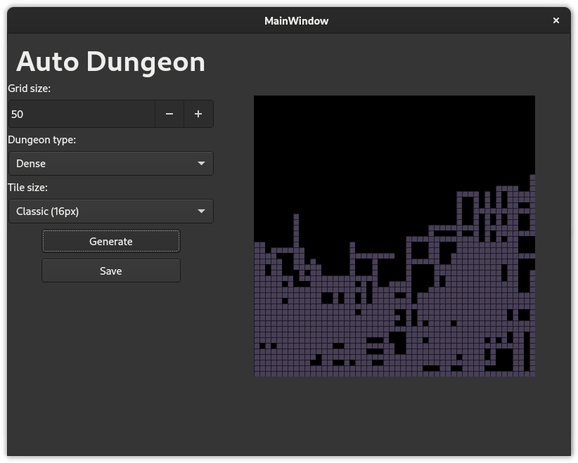

# Auto Dungeon

This is a simple project that generates random dungeon maps for tabletop rpgs, or for regular crpgs. This helps you save some time with level desing by generating various types of dungeons.

## Features

It supports 3 types of dungeons. Dense, Regular and Sparse. You can specify a size too, but the generation is always a square, as the random generator works better on sqaures by providing better designs.

You can change the tiles on the tiles folder too, but remember to use the same resolution for your dungeon tiles.

## Usage

You can set the 3 options and generate your dungeon, click on the save button to save a png file.

